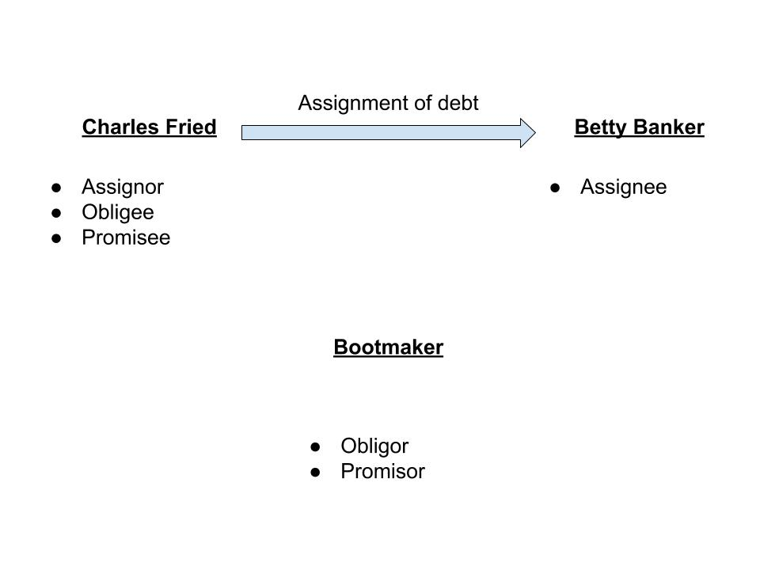

# Contract Law: Harvard X
##### From trusft to promise to Contract

- Contracts are everywhere
- Cooridinating activity between free people.

- Money is promises from people in the past and peolpe in the future

- Buon Governo: Good Government
- Mal governo: bad Government

- Dead weirght loss: allocative inefficienty is a loss of economic effifcieny that can occur when equillibrium for a good ora service is not achieved

`trust=>promise=>Money=>credit=>contracts`

`contracts === promises ==  committments`

> contracts are promises that the government will stand behind
- Not every promises is, or should be or could lead to a contract

---

- Did the person intend to create a legal relationship ?
- Did both parties take the promise seriously or as a joke ?
  - Promises make in frolic and bankter aren't backed by the govermnet
  - Explaining why a joke is funny to invalidate a promise is a necessity to the court
  - governemnts do not enforce illegal or immoral contracts/ promiseses
  - the governmentdoes not enforce promises that are not part of a bargain
  - the government will not enforce a promise to make a gift

  ---

__Four Principles:__
- Invitation to dinner: intent to creat legal relation ?
- Silver watch case(promise made when drunk among friends): Are both sides serious ?
  - Leonard vs Pepsi: Are both sides serious ?
- legal and moral ?
- gift or bargain ?

- Bargain: an agreement betweeen parties  as to what one party will do for another.
- Bargains aer:
  - commercial
  - productive interchanges

- governemnts do note enforce promises that are:
  - - jokes
  - part of relations between friends(frolic and banter/no intention of forming legal relationship)
  - promises to make gifts

- One sided promies: Both paties must exchange value otherwise it is a one sided bargain.
- Government does not back or stand behind one sided bargains.
- Lack of mutualisty: Mutuality of obligation :
- Both parties must be bound to perform their obligations or the law will treat th agreement as if neither party is bound tor intended to perform.
  - When the offerror and the offeree exchanges  promises to perform, one party may not be given the absolute and unlimited right to cancel the contract.

- Good Faith: The implied covenant of good faith and fair dealing is a generat presumption that the parties to a contract will deal with each other honestly, fairly and in good faith, so as to not destroy the right of the other party or paries to receive benefits of the contracts
- "In every contract, theres is an implied covenant that neither party shall do anything, which will have the effect of destroying or injuring the right of the other party to receive the fruites of the contract"
- "Every contract has an implied covenant of good faith and fair dealing."

- basiss of contract is mutual promiseses

---

  - Promissor: The person that makes the promises
  - offereor: the person who initiates the exchanges
    - The offeror sets the terms of the exchange
  - offereee: the receiving party oto the exchange of the promise made by the offeror. He can accept or propose a promise of their own.

- The contract is formed when the offer is accepted. THe exchange is bilateral.
- Promise for promise: I promise to do ... if you promise to ...
- Promise for performance: I promise to ... if ... happens (deliverables are met)

---
- Mirror image rule: An unequivocal and absolute acceptance requirement(conditional promise) states that an offer must be accepted exactly with no modifications i.e a mirror image oof the proposal.
- An attempt to acceptt the offer on different terms is termed as a counter offer.

- "A person should not be bound to a primise e's never made"
- Not just freedom of contract but freedom from contract.

---
- Option: the right to require another person to uphold the agreed - upon terms
- an option is a part of the contract but has to be exercised for the contractto come into play.

- Promises made with enough deliberation and formality will be enforced by the government. Even if there is no actual bargain. (in cases of charitable donations)

- Detrimental Reliance: {need to check}

- THe reliance on promise must be:
  - Reasonable
  - Forseeable

- Civil law originates from germany and france. Common law is of british descent
- Napolean came up with Private law (civil). known for comprehensiveness, system and simplicity of statement.
- "An ordinary citizen must be able to interpret it without an army of specialists." Called it "code Napolean" and is now known as "code civil"

- civil law focusses on the subjective state of mind of parties than does the common law.
- "accord de volentes ..." is equivalent to "manifestation of mutual assent"

- common law is much more obThe code civil asks not only promisor's intent but also the basis (cause) for committment

- Reticence Dolosive: Fraudulent withholding of information
- If one of the parties withhold the kowledge of or the information that would result in the other party not willingly enter into this contract or say take advantage of private, non public information; the civil law will most likely invalidate the agreement.
  - Case Study:Laidlaw v Organ

- Doctrine of bargain: {need to check}
- The code vivil asks not only the promisor's intent but also the basis (cause) for commmitment.
  - causa (latin: cause)
  - cause =/= consideration

- unilateral promise: one way promise; works in civil not common court
- Option without a bargain holds up in civil court not common court since it is unilateral and takes into account, the parties mental state.
- if an offer is withdrawn in unexpected and harmful ways, offeree can invoke 'culpa incontrahendo' which is latin for for "fault or wrongdoing in contracting"
- Pre contractual liability is enforced in civil court more than common law.
- German : Treu and Glauben
- Eng : Good faith and fair dealing

- If you don't tell a lie, if you don't do or say anything that imposes (which involves lying to the other party), the bargain holds even if you have special knowledge.
- anybody that has insider information -  information that is not available to the public and uses it is guilty of security fraud
- "Force Maejure clause": Act of god
  - In case of an unexpected catastrophe, a clause to call the deal off
- Expectation damages: The disapointed party, thre vitctime of the breach is entitles to be put in the same position he would've been if the contract had been kept.
- What you're entitled to is the value you've been promised.
- __In case of damages:__ courts do not penalize but award damages only.

---

- An assigner assigns the debt to an assignee (Bank)
- Obligation: obligor and obligee

- unique value: if the breach of contractinvolves surrendering property of unique value to someone else as a result of breach of contract, something that's irreplaceable or of unique value gets out of hand; in situations like these, the court can enforce specific performance or action by the person(promisor) breaching the contract.

Reference: http://law.jrank.org/pages/10411/Specific-Performance-Inadequate-Legal-Remedy.html

---

- Promisor: THe part that agress to performance or action of quantity in contract that will benefit a third party
- Promisee: The party to whom the promise to benefit a third party is made.
- Beneficiary: The third party who is not a party to the contract, but to whom the contract will deliver a benefit.

- If a promisor breaches the contract, the promisee may sue the promisor. The Beneficiary may sue the promisor directly. THe beneficiary also retains the right to sue the promisee.
- A third party beneficiary of a gift may sue the promisor if the promisor breaches the contract. IF the promisee alters the contract so that the promisor does not grant the beneficiary the benefit; the beneficiary may not sue the promisee or the promisor.
- Basically, if the person promises to make a gift to a third party beneficiary and revokes it, the third party beneficiary cannot sue anyone.

---

##### Assignment:

In a scenario where the bootmaker promises to pay for something at a later point of time.

Assignor(promisee) sells the promise to the assignee(Third party banker). The promisor is now supposed ot pay th assignee.

---

- credit from 'credre' : to Believe
- Promissory note: Assigned document containing a written promise tp pay a stated sum to a specified person or bearer at a specified date or on demand.
  - Bank is a negotiated third party
  - A negotiation is an Assignment free of all possible underlying conflict in a contract.
  - A promisory note can be assigned, negotiated to a third party free and clear of any details of the original contract.
  - The promise of the note must be unconditional as per law.

- The currency note is a promissory note;
  - promisee: the government
  - promisor: the bearer
---
- Auction: {To be checked}
  - bid is synonymous to offer

- agent: Somebody who is under contract under agreement to act for(on behalf of) another person
- partnership: Anything one of the partners does is done in the name of and on the credit of the partnership; All partners are liable for any action taken by any of the partners.
- Agency: Obligation incurred by agent on behalf of the principal. The obligation are the principal's and not the agent's.
- In partnerships: Each partner is a principal and an agent for all the other parties.
- In corporate law: "They cannot pierce the corporate veil."

- A corporation is a network of contracts but no one person or persons are the corporation.
- The principalshareholders bear contractual agreement with the corporation that limits the liability they are at risk to.
- Corporations are government entities
- People that use corporatoins as a way of investing and limiting their risk have to do it on government terms because corporations are creations of the government.
- In situations of unethical or non governmental conduct, the government may allow piercing of the corporate veil to allow public to recover from the shareholder's personal property.

---
__*The end*__
---

Reference:
- [Harvardx: HLS2X Contract Law: From Trust to Promise to Contract](https://courses.edx.org/courses/course-v1:Harvardx+HLS2X+2T2018/course/)

Credit: Thanks to Charles Fried and EDx

-- Prahalad Belavadi
